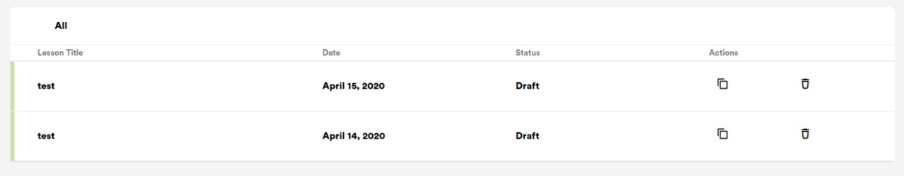

# EJERCICIO 1

## Consigna:

Dado el siguiente dato: `Array<JSON>` (array de objectos json)
```javascript
[
  {
    id: 1, 
    title: "lesson 1", 
    date: "2020-04-21T15:52:14.565Z",
    status: ""
  },
  {
    id: 2, 
    title: "lesson 2", 
    date: "2020-04-22T15:52:14.565Z",
    status: ""
  },
  {
    id: 3, 
    title: "lesson 3", 
    date: "2020-04-23T15:52:14.565Z",
    status: ""
  }
]
```
El resultado final es la tabla de la imagen, que se encuentra como `TABLA.jpeg` en el directorio del proyecto.



Ayudas:
- html: https://developer.mozilla.org/es/docs/Web/HTML/Elemento/table
- css: clases y pseudo elementos (::before)
- js: .map()

&nbsp;
## QUE SE ESPERA?

Generar de forma dinámica cada fila de la tabla con el array dado, respetando lo mejor posible los estilos y el work-flow de git, github y pull request.

**No entra** en el scope del ejercicio los iconos en la columna Actions, simplemente dejarla vacía.